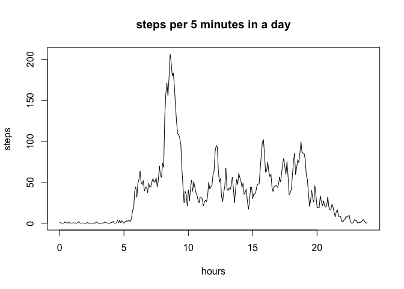
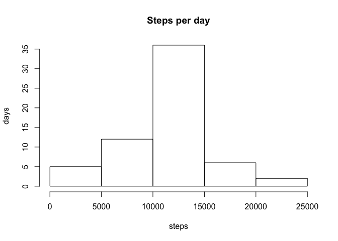
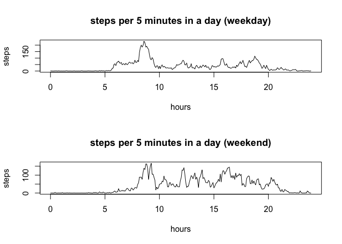

# Reproducible Research: Peer Assessment 1


## Loading and preprocessing the data


```r
activity <- read.csv("activity.csv")
```


## What is mean total number of steps taken per day?


```r
steps.sum <- aggregate(steps ~ date, data = activity, FUN = sum)
steps.sum.mean <- sprintf("%5.2f", mean(steps.sum$steps))
steps.sum.median <- median(steps.sum$steps)
```

Mean total steps per day: 10766.19

Median of total steps per day: 10765

## What is the average daily activity pattern?


```r
steps.pattern <- aggregate(steps ~ interval, data = activity, FUN = mean)
steps.max = steps.pattern$interval[ which.max(steps.pattern$steps) ]
```
Interval with the max steps: 835


```r
plot(x = steps.pattern$interval %/% 100 + (steps.pattern$interval %% 100)/60, 
     y = steps.pattern$steps, 
     type='l', xlab = "hours", ylab = "steps", main = "steps per 5 minutes in a day")
```

 


## Imputing missing values


```r
missing <- length (activity[is.na(activity$steps), 1])

activity.filled <- merge(activity, steps.pattern, by = "interval", all.x = TRUE)
for (i in 1:dim(activity.filled)[1]) {
  if (is.na(activity.filled$steps.x[i])) activity.filled$steps.x[i] <- activity.filled$steps.y[i]
}
activity.filled <- activity.filled[ order(activity.filled$date, activity.filled$interval), c(1:3)]
colnames (activity.filled) [2] <- "steps"


steps.filled.sum <- aggregate(steps ~ date, data = activity.filled, FUN = sum)
steps.filled.sum.mean <- sprintf("%5.2f", mean(steps.filled.sum$steps))
steps.filled.sum.median <- sprintf("%5.2f", median(steps.filled.sum$steps))
```
number of missing vales: 2304

Mean total steps per day: 10766.19 (original: 10766.19)

Median of total steps per day: 10766.19 (original: 10765)


```r
hist(steps.filled.sum$steps, xlab = "steps", ylab = "days", main = "Steps per day")
```

 

## Are there differences in activity patterns between weekdays and weekends?


```r
Sys.setlocale(category="LC_ALL", "en_US")
```

```
## [1] "en_US/en_US/en_US/C/en_US/ja_JP.UTF-8"
```

```r
activity.filled$dayclass <- "weekday"
activity.filled$dayclass <- ifelse ((weekdays(as.Date(activity.filled$date)) == "Sunday" |
                                       weekdays(as.Date(activity.filled$date)) == "Saturday"), 
                                    "weekend", "weekday")
steps.pattern.weekday <- aggregate(steps ~ interval, 
                                   data = activity.filled[activity.filled$dayclass == "weekday",], 
                                   FUN = mean)
steps.pattern.weekend <- aggregate(steps ~ interval, 
                                   data = activity.filled[activity.filled$dayclass == "weekend",], 
                                   FUN = mean)
```


```r
par(mfrow = c(2, 1))
plot(x = steps.pattern.weekday$interval %/% 100 + (steps.pattern.weekday$interval %% 100)/60, 
     y = steps.pattern.weekday$steps, 
     type='l', xlab = "hours", ylab = "steps", main = "steps per 5 minutes in a day (weekday)")
plot(x = steps.pattern.weekend$interval %/% 100 + (steps.pattern.weekend$interval %% 100)/60, 
     y = steps.pattern.weekend$steps, 
     type='l', xlab = "hours", ylab = "steps", main = "steps per 5 minutes in a day (weekend)")
```

 
